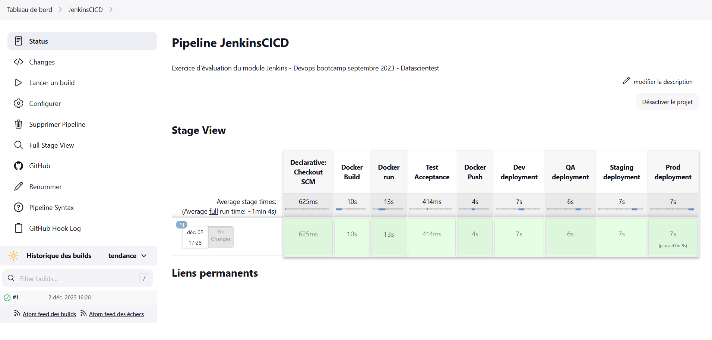
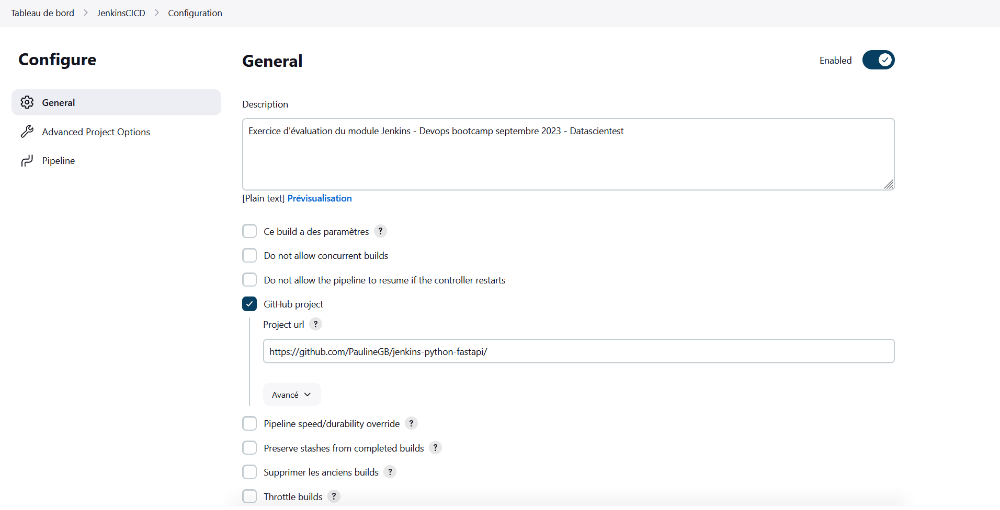
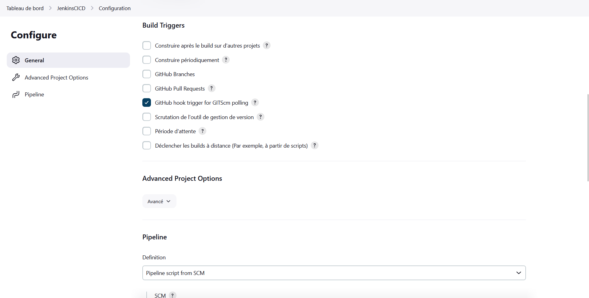
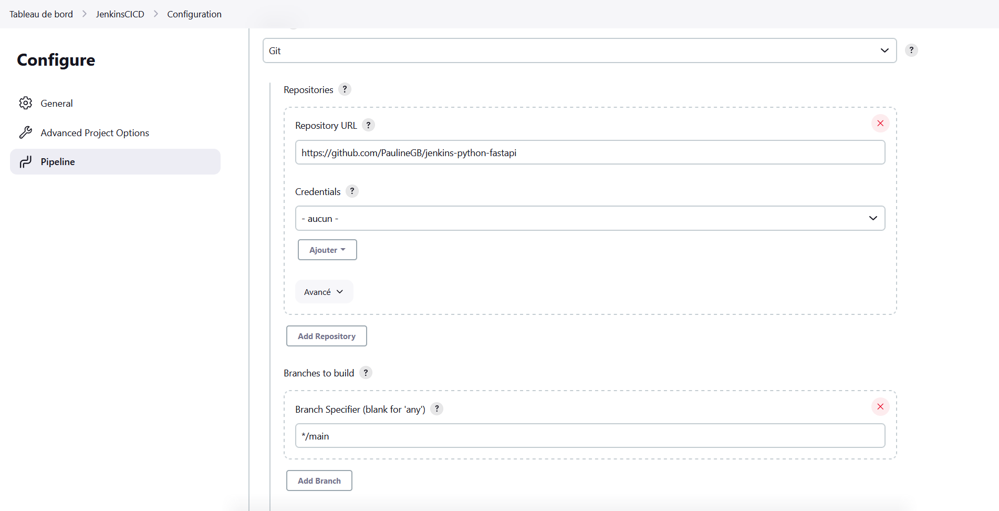

# DATASCIENTEST JENKINS EXAM

# python-microservice-fastapi

Learn to build your own microservice using Python and FastAPI

## Build - Dockerhub

Docker images are stored and updated on Dockerhub.  
Here is the link to the Dockerhub account in the way to check pulled images :  
https://hub.docker.com/repositories/p0l1na

## Deploy

All microservices are deployed using Helm charts and Jenkins.

## Jenkins

Jenkins deployment is ready to go.

Whith the good configuration.

